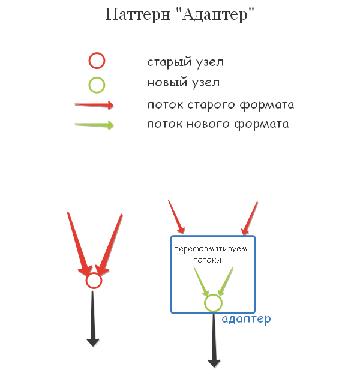

# Конспект 'JS PATTERNS'

[link](#15-state)

## Creational
--

Данная статья создавалась как конспект [урока по JS-паттернам от Владилена](https://www.youtube.com/watch?v=YJVj4XNASDk&t=4011s).
По мере углубления появлялись другие источники, например [плейлист на канале webDev](https://www.youtube.com/playlist?list=PLNkWIWHIRwMGzgvuPRFkDrpAygvdKJIE4).  Бывало ли, что прочитав материал о нескольких паттернах, вы начинали подозревать, что все они делают одно и то же, и зачем учить все, если можно обойтись одним?! У меня - да. Поэтому большинство примеров редактировалось, скрещивалось с другими кодами, обрастало комментариями, либо переписывалось "с читого листа" только с одной целью - чтобы глядя на них я мог легко сказать, чем одни паттерны отличаются от других. Надеюсь, тебе, дорогой читатель, эти правки покажутся достаточно прозрачными. А может и нет... однако я попытался. В общем, поехали.

### 1 constructor

Паттерн 'constructor' - представляет собой создание класса. Более подробно [тут](https://learn.javascript.ru/class).  

      class Server {
        constructor(name, ip) {
          this.name = name
          this.ip = ip
        }

        getUrl() {
          return `https://${this.ip}:80`
        }
      }

      const aws = new Server('AWS German', '82.21.21.32')
      console.log(aws.getUrl())

### 2 factory

Данный паттерн позволяет автоматизировать процесс создания серии однотипных объектов. В данном примере паттерн представляет собой _class_:

        class SimpleMembership {
          constructor(name) {
            this.name = name
            this.cost = 50
          }
        }

        class StandardMembership {
          constructor(name) {
            this.name = name
            this.cost = 150
          }
        }

        class PremiumMembership {
          constructor(name) {
            this.name = name
            this.cost = 500
          }
        }

Вместо того, чтобы каждый раз создавать объекты разных классов:  

      const standardMember = new StandardMembership('Lena')
      const simpleMember = new SimpleMembership('Pete')
      const premiumMember = new PremiumMembership('Ivan')

...можно создать объект **factory** (абстрактно на уровень выше), который позволит делать то же самое, но в единой форме. Как-то так:

    factory.create('Lena', 'standard')
    factory.create('Pete', 'simple')
    factory.create('Ivan', 'premium')

Реализация:

      class MemberFactory {
        static list = {
          simple: SimpleMembership,
          standard: StandardMembership,
          premium: PremiumMembership
        }

        create(name, type = 'simple') {
          const Membership = MemberFactory.list[type]
          const member = new Membership(name)
        }
      }

      const factory = new MemberFactory()

      const members = [
        factory.create('Vladilen', 'simple'),
        factory.create('Elena', 'premium'),
        factory.create('Vasilisa', 'standard'),
        factory.create('Ivan', 'premium'),
        factory.create('Petr')
      ]

      members.forEach(m => {
        console.log(m)
      })

В методе **create** можно объявлять новые методы и свойства:

      create(name, type = 'simple') {
        const Membership = MemberFactory.list[type] || MemberFactory.list.simple
        const member = new Membership(name)
        member.type = type
        member.define = function() {
          console.log(`${this.name} (${this.type}): ${this.cost}`)
        }
        return member
      }

### 3 prototype

Допустим, есть 2 объекта. Причем один является потомком другого. Паттерн
**prototype** позволяет создавать свойства и методы в родителе или потомке, которых не было изначально во время объявления.

### 4 singleton

Объект проходит инициализацию только один раз! Повторный запуск инициализации вернёт предыдущий результат.

    class Database {
      constructor(data) {
        if (Database.exists) {
          return Database.instance
        }
        Database.instance = this
        Database.exists = true
        this.data = data
      }

      getData() {
        return this.data
      }
    }

    const mongo = new Database('MongoDB')
    console.log(mongo.getData()) // 'MongoDB'

    const mysql = new Database('MySQL')
    console.log(mysql.getData()) // 'MongoDB', а не 'MySQL'

### 5 adapter

Используется, если в проекте необходимо направить потоки вычислений через другой узел, при это не изменяя самих потоков:

  

В нашем примере в качестве адаптера выступает класс CalcAdapter:

    class OldCalc {
      operations(t1, t2, operation) {
        switch (operation) {
          case 'add': return t1 + t2
          case 'sub': return t1 - t2
          default: return NaN
        }
      }
    }

    class NewCalc {
      add(t1, t2) {
        return t1 + t2
      }

      sub(t1, t2) {
        return t1 - t2
      }
    }

    class CalcAdapter {
      constructor() {
        this.calc = new NewCalc()
      }

      operations(t1, t2, operation) {
        switch (operation) {
          case 'add': return this.calc.add(t1, t2)
          case 'sub': return this.calc.sub(t1, t2)
          default: return NaN
        }
      }
    }

    const oldCalc = new OldCalc()
    console.log(oldCalc.operations(10, 5, 'add'))

    const newCalc = new NewCalc()
    console.log(newCalc.add(10, 5))

    const adapter = new CalcAdapter()
    console.log(adapter.operations(25, 10, 'sub'))

### 6 decorator

В качестве декоратора обычно выступает функция, которая добавляет в существующий класс новые свойства/методы:

    class Server {
      constructor(ip) {
        this.ip = ip
      }
    }

    // добавляем свойство isAWS и метод awsInfo
    function aws(server) {
      server.isAWS = true
      server.awsInfo = function() {
        return server.ip
      }
      return server
    }

    const s1 = aws(new Server('12.34.56.78'))
    console.log(s1.isAWS)
    console.log(s1.awsInfo())

### 7 fasade

Фасад - это объект(класс, функция), который представляет собой обертку над другими объектами. Технически в теле фасада объявляются другие объекты (обычно несколько). В результате, в основном коде будет представлен легко читаемый фасад, а вся логика, будет расписана в его теле.

      let credits = counter(money);
      if (credits > 100) {
        product = new PremiumCar()
      }else{
        product = new StandardCar()
      }

Вместо того, чтобы расписывать логику в основном коде, можно обернуть её в класс-фасад.

      class Fasade {
        constructor(counter){
          this.calc = counter;
        }
        welcome (money){  
          if (this.calc(money) > 100) {
            return new PremiumCar()
          }else{
            return new StandardCar()
          }
        }
      }

Теперь в основном коде вызывается более читабельный фасад:

      let toTheReal = new Fasade(counter);
      let product = toTheReal.welcome(money)

### 8 flyweight

Данный паттерн обычно используется в связке с паттерном _factory_. **Flyweight** позволяет избежать создания дублирующихся сущностей. Для этого, в теле паттерна создаётся кэш, в котором хранятся ранее созданные сущности.

    this.cars = [] // кэш

Если в паттерн поступает дубль, то возвращает из кэша ранее созданную сущность.

    const candidate = this.checkDouble(model) // ищет в кэше дубли
    if (candidate) {
      return candidate
    }

Иначе вызывается паттерн _factory_ который создаёт новый объект, ссылка на который помещается в кэш.

    const newCar = new Car(model, price) // factory
    this.cars.push(newCar) // помещаем ссылку в кэш

Результат работы паттерна **flyweight** наглядно показан ниже:

    const factory = new CarFactory()
    const bmwX6 = factory.create('bmw', 10000) // {model: 'bmw', price: 10000}
    const audi = factory.create('audi', 12000) // {model: 'audi', price: 12000}
    const bmwX3 = factory.create('bmw', 8000) // {model: 'bmw', price: 10000} !!!

    console.log(bmwX3 === bmwX6) // true

====  
в отличие от _singleton'a_ (который является паттерном типа Creational), **flyweight** не создаёт новые сущности, а представляет собой инструмент для проверки дублей.

### 9 proxy

Представляет собой прослойку между клиентом и оригинальным объектом, к которому мы обращаемся.

        Client => Proxy => Original Object
 **Proxy** позволяет, не изменяя способов обращения к оригинальному объекту, производить дополнительную обработку запросов. Рассмотрим пример защищающего **proxy**.

    // обычный класс, управляющий открытием дверей
    class CarAccess {
     open() {
       console.log('Opening car door')
     }

     close() {
       console.log('Closing the car door')
     }
    };
    // работает в виде:
    const door = new CarAccess();
    door.open();

Теперь построим **proxy**, которая будет требовать авторизацию перед открытием дверей.

    class SecuritySystem {
     constructor(door) {
       this.door = door;
     }

     open(password) {
       if (this.authenticate(password)) {
         this.door.open();
       } else {
         console.log('Access denied!');
       }
     }

     authenticate(password) {
       return password === 'Ilon';
     }

     close() {
       this.door.close()
     }
    };

    const door = new SecuritySystem (new CarAccess());
    door.open('Ilon'); // 'Opening car door'

Как видим, характер запроса практически не изменился, однако наличие дополнительного абстрактного уровня позволило добавить систему авторизации пользователя. Помимо защищающего существуют также другие виды паттерна proxy: кэширующий (см. пример из ролика), виртуальный, логирующий.

    console.log(proxiedFetch('angular.io')) // angular.io - Ответ с сервера
    console.log(proxiedFetch('react.io')) // react.io - Ответ с сервера
    console.log(proxiedFetch('angular.io')) // angular.io - Ответ из кэша

Behaviour
--

Поведенческие паттерны позволяют улучшить взаимодействие между объектами разного типа.

### 10 chain of responsibility

Позволяет организовывать цепочку из одних и тех же методов, которые вызываются через рекурсию. Ниже приведены несколько примеров:

    console.log(sum1.add(8).add(10).add(1).add(9).sum) // sum = initialValue + 8 + 10 + 1 + 9

В данном случае вызываемая цепочка методов суммирует все передаваемые и начальное значение(_initialValue_). Для реализации такой цепочки, необходимо, чтобы метод _add(val)_ возвращал свой контекст (_this_). А в данном примере, еще необходимо сохранять результат вычислений в свойство _sum_.

    class MySum {
      constructor(initialValue = 10) {
        this.sum = initialValue
      }
      add(value) {
        this.sum += value
        return this
      }
    }

    const sum1 = new MySum();
    console.log(sum) // {sum: 42}
    console.log(sum1.add(8).add(10).add(1).add(9).sum)

### 11 command

Чтобы понять для чего используется данный паттерн, рассмотрим практическую задачу. Допустим, у нас есть простой класс, в который _Клиент_ отправляет запросы (в данному случае изменяет форму фигуры).

```
class Figure0 {
  constructor(defValue){
    this.form = defValue||'dot';
  }
  shape(form){
    this.form = form;
    console.log(`I've become ${this.form}`);
  }
};

const fig = new Figure0("dot");

// команды клиента
fig.shape('round');
fig.shape('line');
fig.shape('square');
fig.shape('dot');


/* Console:
  I've become round  
  I've become line  
  I've become square  
  I've become dot
*/
```

Представим себе, что перед нами стоит задача - логировать выполняемые команды и, если необходимо, отменять выполненные команды. Как это сделать? Конечно же можно добавить дополнительные методы в существующий класс. Например:

```
class Figure1 {
  constructor(defValue){
    this.form = defValue||'dot';
    this.cache = [];  //  <------ храним список форм.
  }
  shape(form){
    this.cache.push(this.form)  //  <--- логируем текущее значение
    this.form = form;
    console.log(`I've become ${this.form}`);
  }

  undo(){
    this.form = (this.cache.length - 1)?
                this.cache.pop(): this.form; // <---- вызов последнего элемента из кэша
    this.shape(this.form);
    if (this.cache.length) this.cache.pop();  // <---- Костыль:
                                              // компенсируем push, вызванный методом выше
  }
};
```

Работает это так:
```
const fig = new Figure();
fig.shape('round');
fig.shape('line');
fig.shape('square');
fig.shape('dot');
console.log(fig);

fig.undo();
fig.undo();
fig.undo();
fig.undo();
fig.undo();
fig.undo();


/* Console:
  I've become round
  I've become line
  I've become square
  I've become dot
  Figure1 { form: 'dot', cache: [ 'dot', 'round', 'line', 'square' ] }

  I've become square
  I've become line
  I've become round
  I've become round
  I've become round
  I've become round
  Figure1 { form: 'round', cache: [ 'dot' ] }
*/
```

Сразу же обращаем на минусы данного метода:
1. Мы внесли изменения в начальную конструкцию класса и прописали совершенно не характерные для него свойства и методы.
2. Пришлось додумывать костыли, т.к. за логирвоание методов в массив отвечают сами методы.
3. Пока не првоерял, но подозреваю, что могут возникнуть проблемы в строке:  
`this.cache.push(this.form)`  
поскольку, если в аргументе `this.form` передаётся объект, то cache будет заполнен ссылками. Так, изменения в самом объекте, могут привести к нежелательным изменениям в массиве cache.


Паттерн **command** позволяет решить данную задачу, не меняя начальной структуры класса. Для этого создается класс:
```
class Command {
  constructor(subject){
    this.subject = subject; // <---- класс, над которым оборачивается паттерн
    this.cache = [];
  }

  // action - вызываемый метод объекта
  // args - массив, в котором находятся аргументы для метода action

  execute(action, args){
    this.cache.push({action, args});      // <---- кэшируем команды
    return this.subject[action](...args); // <---- ...и выполняем
  }

  undo(){
    if (this.cache.length - 1) this.cache.pop();
    const action = this.cache[this.cache.length - 1].action;
    const args = this.cache[this.cache.length - 1].args;
    return this.subject[action](...args);
  }
};
```
Данный паттерн добавляет дополнительную прослойку между клиентом и _subject_'ом. Т.о., клиент передаёт команды в **command**, а тот в свою очередь обращается к _subject_'у, логируя данные в кэш.
```
const command = new Command(new Figure0());

// команды от клиента к паттерну:
command.execute('shape', ['round']);
command.execute('shape', ['line']);
command.execute('shape', ['square']);
command.execute('shape', ['dot']);
console.log(command.cache)
command.undo();
command.undo();
command.undo();
command.undo();
console.log(command.cache)

/*
Console:

I've become round
I've become line
I've become square
I've become dot
[
  { action: 'shape', args: [ 'round' ] },
  { action: 'shape', args: [ 'line' ] },
  { action: 'shape', args: [ 'square' ] },
  { action: 'shape', args: [ 'dot' ] }
]
I've become square
I've become line
I've become round
I've become round
[ { action: 'shape', args: [ 'round' ] } ]
*/
```

Заметим, что методы паттерна **command** совершенно не зависят от _subject_, т.е. он может принимать в себя любые классы.

### Итератор

Данный паттерн нужен для обхода компонентов списка. Иногда вместо того, чтобы перегружать объект списка дополнительными итерирующими методами, лучше создать паттерн, предназанченный для этого. Например, если стурктура списка будет нелинейно, а, например, древовидной, то встроенными циклами перебрать каждый элемент не получится.  Паттерн **итератор** включает метод _hasNext_ (проверка существования следующего элемента. False - дошли до конца) и метод _next()_ (переход к следующей итерации).

Реализация паттерна может быть любой и зависит от структуры самого объекта. Поэтому, как я понял, создаётся родительский класс, который включает в себя начальные значения свойств и упомянутые ранее методы. А для конкретного объекта создаётся создаётся класс-потомок, который снабжается логикой, необходимой для обхода всех компонентов.

Ниже приведены 2 самых примитивных итератора, 1 - для обхода массивов, 2 - для обхода объектов. Да, в таких простых случаях лучше использовать обычные циклы. Но, возможно, эти примеры помогут в дальнейшем:
```
class ArrayIterator {
	constructor(el) {
		this.index = 0;
		this.elements = el;
	}

	next() {
		return this.elements[this.index++];
	}

	hasNext() {
		return this.index < this.elements.length;
	}
};

class ObjectIterator {
	constructor(el) {
		this.index = 0;
		this.keys = Object.keys(el),
		this.elements = el;
	}

	next() {
		return this.elements[this.keys[this.index++]];
	}

	hasNext() {
		return this.index < this.keys.length;
	}
};
```


### 13 mediator

Данный паттерн также называют "посредник". Это поведенческий паттерн, который позволяет уменьшить взаимосвязь классов между собой, вынося межклассовые связи в класс-посредник.
Пример Владилена довольно показателен. Допустим, требуется реализовать чат между тремя пользователями одного класса. Без дополнительного класса, придётся создавать связи между всеми пользователями. Количество подобных связей будет также увеличиваться по мере добавления новых пользователей, т.о. класс пользователя утрачивает гибкость и масштабируемость.

.

Картинка и доп. информация взяты [отсюда](https://refactoring.guru/ru/design-patterns/mediator). Решением проблемы является ввод класса **медиатора** - _ChatRoom_, который берёт на себя проблему адресации сообщений.


Вот пример класса User:
```
class User {
  constructor(name) {
    this.name = name
    this.room = null
  }

  send(message, to) {
    this.room.send(message, from, to)
  }

  receive(message, from) {
    console.log(`${from.name} => ${this.name}: ${message}`)
  }
}
```
Как видим, довольно лаконичный объект. Теперь рассмотрим реализацию паттерна.
```
class ChatRoom {
  constructor() {
    this.users = {} // <---- коллекция пользователей
  }

  /*
   Ниже передаём медиатору всех пользователей (по ссылке), которых он будет координировать, а в класс пользователей
   добавляем медиатр. Так каждому пользователю станет доступен метод send медиатора
  */
  register(user) {
    this.users[user.name] = user
    user.room = this
  }

  send(message, from, to) {
    if (to) {
      to.receive(message, from)
    } else {
      Object.keys(this.users).forEach(key => {
        if (this.users[key] !== from) {
          this.users[key].receive(message, from)
        }
      })
    }
  }
}
```

Реализация:

```
const vlad = new User('Vladilen')
const lena = new User('Elena')
const igor = new User('Igor')

const room = new ChatRoom()

room.register(vlad)
room.register(lena)
room.register(igor)

vlad.send('Hello', lena)  // 'Vladilen => Elena: Hello'
igor.send('Всем привет!') // 'Igor => Vladilen: Всем привет!'
                          // 'Igor => Elena: Всем привет!'
```

### Observre

Паттерн **observer** он же _Наблюдатель_ формирует шаблон подписки, позволяющий одним объектам (_Подписчикам_) следить за изменениями в других объектах (_Издателях_). Думаю, лучшая аналогия представлена в книге[3]:

>Представьте, что вы имеете два объекта: Покупатель и Магазин. В магазин вот-вот должны завезти новый товар, который интересен покупателю.  
>Покупатель может каждый день ходить в магазин, чтобы проверить наличие товара. Но при этом он будет злиться, без толку тратя своё драгоценное время.
>  
>
>
>Постоянное посещение магазина или спам?  
С другой стороны, магазин может разослать спам каждому своему покупателю. Многих это расстроит, так как товар специфический, и не всем он нужен.  
Получается конфликт: либо покупатель тратит время на периодические проверки, либо магазин тратит ресурсы на бесполезные оповещения.

Паттерн **observer** не является одним классом(объектом), а представляет собой интерфейс, созданный взаимодействующими частями объектов Издателя и подписчиков. Внутри объекта Издателя хранится список ссылок на объекты подписчиков. А объекты подписчики должны иметь в себе методы, которые способны отслеживать изменения в Издателе.  
По приходу оповещения подписчику нужно получить обновлённое состояние издателя. Издатель может передать это состояние через параметры метода оповещения. Более гибкий вариант — передавать через параметры весь объект издателя, этот способ мы рассмотрим в примере:

<!--  -->

Рассмотрим рассылку новостей от издателя (AutoNews) и несколько классов-подписчиков на эту рассылку. Характерные свойства и методы:
1. Для Издателя:  
  * имеется список с подписчиками `actions=[]`.
  * методы подписки/отписки `register/unregister()`
  * метод рассылки сообщений `notifyAll()`. Обращается к методу _inform_ в классах-подписчиках. И в качестве параметра передаёт ссылку на свой контекст. Т.о., _подписчики_ могут следить за новостями ~~состоянием свойств объекта _Издателя_~~.
2. Для классов подписчиков характерен один важный момент. В данном примере можно было бы сделать их потомками одного родительского класса, но подписчики _Jack_ и _Max_ разделены, чтобы подчеркнуть разную природу их происхождения. Но, несмотря на это, у обоих должен присутствовать метод `inform()`, который отвечает за обработку обновлений от _Издателя_.

```
class AutoNews {

	constructor() {
		this.news = '';
		this.actions = [];
	}

	setNews(text) {
		this.news = text;
		this.notifyAll();
	}

	notifyAll() {
		return this.actions.forEach(subs => subs.inform(this));
	}

	register(observer) {
		this.actions.push(observer);
	}

	unregister(observer) {
		this.actions = this.actions.filter(el => !(el instanceof observer));
	}
};

class Jack {
	inform(message) {
		console.log(`Jack has been informed about: ${message.news}`);
	}
};

class Max {
	inform(message) {
		console.log(`Max has been informed about: ${message.news}`);
	}
};
```
Реализация:
```
const autoNews = new AutoNews();

autoNews.register(new Jack());
autoNews.register(new Max());

autoNews.setNews('Tesla forever!')

/*
'Jack has been informed about: Tesla forever'
'Max has been informed about: Tesla forever'
*/
```

### 15 state

Паттерн **State** (_Состояние_) позволяет менять своё поведение в зависимости от собственного состояния. В примере Владилена реализован объект, отвчающий за движение транспорта на светофоре. Если состояние светофора - "красный", то объект traffic, выполняет метод "СТОП", для состояния "желтый" - "ГОТОВЬСЯ", для "зелёного" - "ЕДЬ!".  
Вроде бы всё просто, но зачем вводить паттерн, если всю логику можно описать с помощью конструкции if или switch?
```
class TrafficLight{
  constructor(initialState){
    this.state = initialState;
  }
  change(){
    switch (this.state){
      case 'red':
        this.doStop();
        this.state = 'yellow';
        break
      case 'yellow':
        this.doReady();
        this.state = 'green';
        break;
      case 'green':
        this.doGo();
        this.state = 'red';
        break
    }
}
```
Представим, что мы работаем с объектом, у которого не 3, а гораздо больше состояний. При этом, со временем могут добавляться дополнительные состояния. В этом случае, конструкция switch будет раздуваться и объект потеряет расширяемость.

В таких случаях на помощь приходит паттерн **state**. Он предполагает  создание родительского класса _State_, от которого для каждого конкретного состояния создаются дочерние классы (_concreteState_). Получается, что объект _Context_ делигирует классам _concreteState_ работу с состянием, с переключением состояний, а иногда и методы, связанные с текущим состоянием.


В качестве примера рассмотрим изменение статусов интернет-заказа в патерне **state**.
```
class OrderStatus {
	constructor(name, nextStatus) {
		this.name = name;
		this.nextStatus = nextStatus;
	}

	next() {
		return new this.nextStatus();
	}
}

class WaitingForPayment extends OrderStatus {
	constructor() {
		super('waitingForPayment', Shipping);
	}
}

class Shipping extends OrderStatus {
	constructor() {
		super('shipping', Delivered);
	}
}

class Delivered extends OrderStatus {
	constructor() {
		super('delivered', Delivered);
	}
}

class Order {
	constructor() {
		this.state = new WaitingForPayment();
	}

	nextState() {
		this.state = this.state.next();
	};

  cancelOrder() { // <---- заказ можно отменить до отправки
    this.state.name === 'waitingForPayment'?
      console.log('Order is canceled!') :
      console.log('Order can not be canceled!');
  }
}
```

Реализация:
```
const myOrder = new Order();
console.log(myOrder.state.name); // <-- 'waitingForPayment'
// Try to cancel order
myOrder.cancelOrder(); // <-- Order is canceled!
myOrder.nextState();
console.log(myOrder.state.name); // <-- 'shipping'
// Try to cancel order
myOrder.cancelOrder(); // <-- Order can not be canceled!
```

### 16 Strategy

Паттерн **Стратегия** используется в тех случаях, когда объект _Контекст_, в зависимости от кейса использует один из множества *схожих* алгоритмов.  
Рассмотрим пример приложения-навигатор. В зависимости от выбора пользователя навигатор может проложить пеший маршрут, маршрут на автомобиле или общественном транспорте. Все 3 способа решают одну задачу - возвращают путь от точка A до точки B. Поэтому имеет смысл делигировать эти способы от объекта контекста в отдельный класс.

В таких случаях, паттерн **Strategy** предполагает создание родительского класса *RootStrategy*, который связан с контекстом единым интерфейсом. А выбранные маршруты будут описаны в дочерних классах, которые называются *стратегиями*.


Рассмотрим пример по описанной выше схеме:
```
// RootStrategy
class Route {
  buildRoute() {
    return this.road
  }
}

// Strategy_1
class Road extends Route {
  constructor() {
    super()
    this.road = 'Car'
  }
}

// Strategy_2
class Walking extends Route {
  constructor() {
    super()
    this.road = 'Sidewalk'
  }
}
// Strategy_3
class PublicTransport extends Route {
  constructor() {
    super()
    this.road = 'Public Route'
  }
}

// Контекст
class Navigator {
  drawWay(transport) {
    return `I draw the way by ${transport.buildRoute()} roads`
  }
}
```

Реализация:
```
const navigator = new Navigator()

console.log(navigator.drawWay(new Road())) // 'I draw the way by Car roads'
console.log(navigator.drawWay(new Walking())) // 'I draw the way by Sidewalk roads'
console.log(navigator.drawWay(new PublicTransport())) // 'I draw the way by Public Route roads'
```
**Стратегия** по своей реализации напоминает паттерн **Состояние**. Оба они построены на принципе *композиции*, т.е. делигировании работы объектам-помощникам. Однако в **Стратегии** эти объекты не знают друг о друге и никак не связаны. В **Состоянии** сами конкретные состояния могут переключать контекст.

Более подробно [в статье 'Стратегия'](https://refactoring.guru/ru/design-patterns/strategy).[3][#Список-источников]

## Список источников:
1. Видеоурок от Владилена: [JavaScript Паттерны. Шаблоны проектирования. 17 Примеров](https://youtu.be/YJVj4XNASDk)
2. Плейлист по паттернам на канале webDev: [JavaScript Design Patterns](https://www.youtube.com/playlist?list=PLNkWIWHIRwMGzgvuPRFkDrpAygvdKJIE4)
3. Раздел "Паттерны" на сайте rafactoring.guru: [Паттерны проектирования](https://refactoring.guru/ru/design-patterns )
